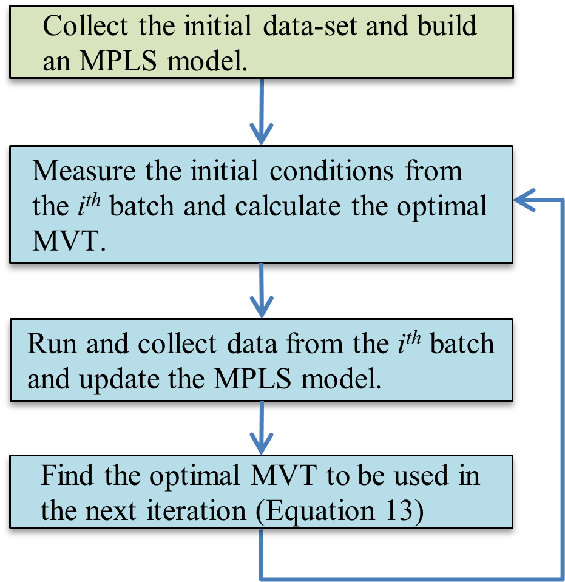
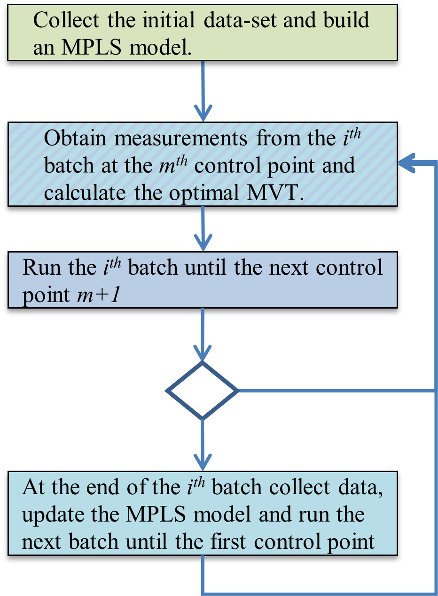
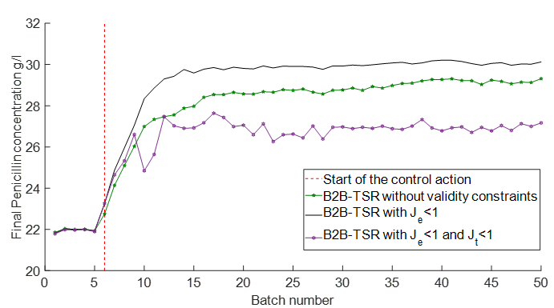

<h1 class="main-title">
    
        Control Systems and Process Optimization
    
</h1>

 

      

## <a href="https://doi.org/10.1016/j.compchemeng.2019.106620" class="contact-link" target="_blank">Multivariate Statistical Process Control of an Industrial-Scale Fed-Batch Simulator</a>.
 
<h3>Project Overview</h3>

Imagine you are running a large factory that produces penicillin. The main challenge is to ensure every batch of penicillin is consistently high quality. Maintaining consistent quality is difficult due to inherent variations in raw materials and process conditions. Each batch of penicillin might have different characteristics, making it hard to achieve uniform quality. Advanced control strategies can help mitigate these issues by predicting and adjusting for these variations in real-time.

<h3 class="centered-heading">
    The Solution: Using Advanced Control Strategies
</h3>

  

    <h4>Batch-to-Batch Optimization (B2B)</h4>
    
Engineered a feedback system that adapts production parameters from batch insights, continuously enhancing product quality and process efficiency.

    

      <figure style="margin: 0;">
        
        <figcaption class="image-caption">
        Figure 1. "Batch to batch (B2B) optimisation flowchart" from Duran-Villalobos et al., 2020.
        </figcaption>
      </figure>
    

  

  

    <h4>Model Predictive Control (MPC)</h4>
    
Developed a predictive control model to manage glucose feed rates, stabilizing penicillin yields despite process variability.

     

    <figure style="margin: 0;">
      
      <figcaption class="image-caption">
        Figure 2. "Model Predictive Control (MPC) flowchart" from Duran-Villalobos et al., 2020.
      </figcaption>
    </figure>
  

  

 
  

    <h4>Validity Constraints</h4>
    
Implemented constraints within the predictive models to ensure safety and reliability of the control strategies based on historical data.

  

  

    <h4>Bootstrap Calculations</h4>
    
Applied bootstrap calculations to establish confidence intervals, providing a robust statistical foundation for predictive accuracy.

  

### Key Results
**Improved Consistency and Yield:** By applying batch-to-batch optimization and MPC, the project demonstrated significant improvements in both the consistency and quality of the penicillin produced. The optimized process resulted in a more stable yield, with less variation between batches. This is crucial for meeting quality standards and ensuring the reliability of the production process.

  <figure style="margin: 0;">
    
    <figcaption class="image-caption">
      Figure 5. "Final penicillin concentration for the B2B campaign..."  from Duran-Villalobos et al., 2020.
    </figcaption>
  </figure>

**Results for B2B and MPC Strategies:** The results indicated that the B2B strategy improved the overall consistency and quality of the production process. MPC further enhanced these results by making real-time adjustments, leading to a significant reduction in variability and an increase in yield consistency.

<table class="data-table"  style="width: 60%">
  <thead>
    <tr>
      <th>Control methodology</th>
      <th>Yield average</th>
      <th>MSE to the set-point</th>
    </tr>
  </thead>
  <tbody>
    <tr>
      <td>No control</td>
      <td>21.84 g/l</td>
      <td>1.22 g/l</td>
    </tr>
    <tr>
      <td>B2B</td>
      <td>30.12 g/l</td>
      <td>1.63 g/l</td>
    </tr>
    <tr>
      <td>B2B + MPC </td>
      <td>29.92 g/l</td>
      <td>0.69 g/l</td>
    </tr>
  </tbody>
</table>

### Conclusion
By using advanced optimization and control techniques, this project demonstrates a significant improvement in the consistency and yield of penicillin production. The combination of batch-to-batch optimization and model predictive control, supported by reliable models and robust validation methods, offers a powerful approach to managing industrial-scale production processes.

<h3>Read More</h3>

For a detailed exploration of our methods and results, you can read the full article:

<a href="https://doi.org/10.1016/j.compchemeng.2019.106620" class="contact-link" target="_blank">Multivariate Statistical Data Analysis of Cell-Free Protein Synthesis</a>

### Projects

Here are my projects related to Control Systems and Process Optimization:



- <a href="{{ project.url }}" class="contact-link" target="_blank">{{ project.title }}</a>  
  {{ project.description }}



